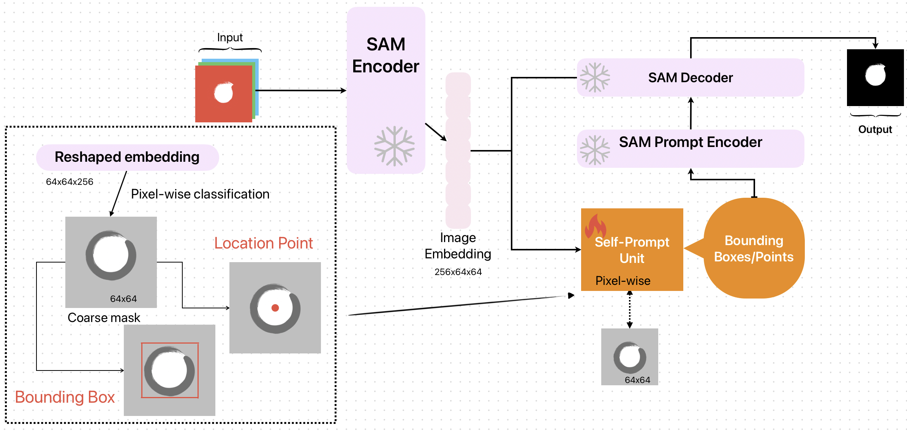

# few-shot-self-prompt-SAM
This is the official repo for "Self-Prompting Large Vision Models for Few-Shot Medical Image Segmentation"


Recent advancements in large foundation models have revo-
lutionized the medical industry due to their flexible prompting capability.
One such model, the Segment Anything Model (SAM), a prompt-driven
segmentation model, has shown remarkable performance improvements,
surpassing state-of-the-art approaches in medical image segmentation.
However, existing methods primarily rely on tuning strategies that re-
quire extensive data or prior prompts tailored to the specific task, mak-
ing it particularly challenging when only a limited number of data sam-
ples are available. In this paper, we propose a novel perspective on self-
prompting in medical vision applications. Specifically, we harness the
embedding space of SAM to prompt itself through a simple yet effective
linear pixel-wise classifier. By preserving the encoding capabilities of the
large model, the contextual information from its decoder, and leveraging
its interactive promptability, we achieve competitive results on multiple
datasets (i.e. improvement of more than 15% compared to fine-tuning the
mask decoder using a few images
## Requirements
The codes is tested on 
- Python 3.11.4
- PyTorch 2.0.1
- Nvidia GPU (RTX 3090) with CUDA version 11.7
1. First run ```conda env create -f environment.yml```
2. Packages for SAM ```pip install opencv-python pycocotools matplotlib onnxruntime onnx```
3. (Optional) We have already clone the SAM repo here. If not working, please follo the guidelines from the official repo of [Segment Anything](https://github.com/facebookresearch/segment-anything/tree/main),
```pip install git+https://github.com/facebookresearch/segment-anything.git```
4. Download the checkpoints of the ViT model for SAM and put it under ```./checkpoints```
- ```vit_b(default)```: [ViT-B SAM model](https://dl.fbaipublicfiles.com/segment_anything/sam_vit_b_01ec64.pth)
- ```vit_l```: [ViT-L SAM model](https://dl.fbaipublicfiles.com/segment_anything/sam_vit_l_0b3195.pth)
- ```vit_h```: [ViT-H SAM model](https://dl.fbaipublicfiles.com/segment_anything/sam_vit_h_4b8939.pth)
5. Download the dataset from the link [Kvasir-SEG](https://drive.google.com/file/d/1AFbMOHdiSrd1gsIbA0iQptYNApnp_l6b/view?usp=share_link)

## Usage
- To get the visualization results: run ```python main.py --checkpoint <path/to/checkpoints/```
## To Do
### Yaoo
1. <s>add codes for Kvasir dataset/ </s> ISIC2018
2. <s>Write env setup
3. Add dataset link</s>
4. Decorate the git repo add a github page
5. Add abstract and Model picture and results
6. Modify abstract: No revolutionizing(reviewer 3)
7. Comparing to Zhou et al.???

### Experiment
1. Unet -- Yao
2. Original SAM, prompt sam --Qi
3. Use log reg on the image directly